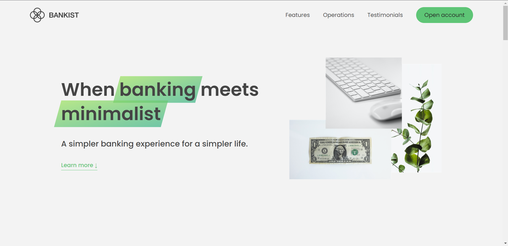

<h1 style="text-align: "center"; style="font-weight: bold;">Bankist Site</h1>

<h1>Introdução</h1>

Esse é o site do app de banco feito com javascript puro.

                 

 <a href="#sobre">Sobre</a> •
 <a href="#demonstração">Demonstração</a> •

## Sobre

O projeto é site de um banco(bankist) com diversas funcionalidades, site com UI minimalista criado pelo instrutor Jonas Schmidtmann, no JavaScript foi implementado smooth scroll na página, também foi feito um slide, modal para abrir conta com possibilidade de fechar com botão, tecla esc e clicando fora do modal, o site foi otimizado com lazy images. 

## Demonstração
 

  <h2>Página feita com:</h2>

 Javascript

CSS

## Feito por Thiago  